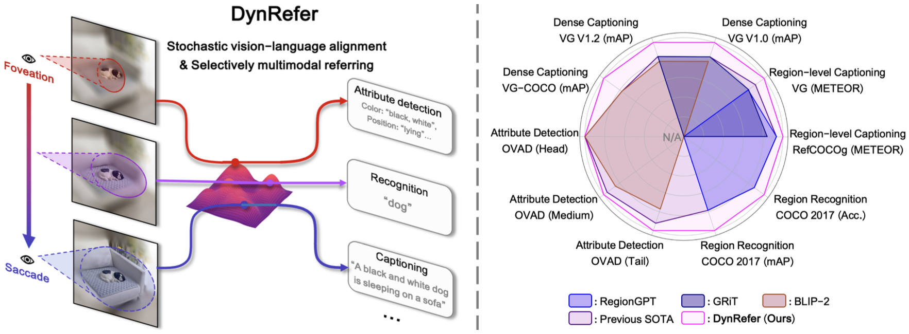
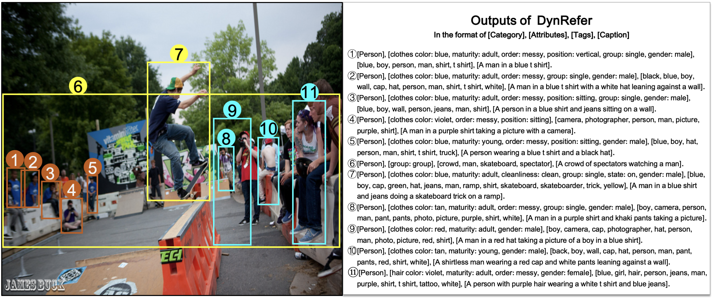

<div align=center>
  
# DynRefer: Delving into Region-level Multimodal Tasks via Dynamic Resolution
</div>

This is the official implementaion of paper '[***DynRefer: Delving into Region-level Multimodal Tasks via Dynamic Resolution***](https://arxiv.org/pdf/2405.16071)', which is accepted in **CVPR 2025**. This repository contains Pytorch training code, evaluation code.

<div align=center>


[](LICENSE)
</div>


<div align=center>

</div>


## 1. Contents
- DynRefer: Delving into Region-level Multimodal Tasks via Dynamic Resolution
  - [1. Contents](#1-contents)
  - [2. Todo](#2-todo)
  - [3. Introduction](#3-introduction)
  - [4. Results](#4-results)
  - [5. Code Usage](#5-code-usage)
  - [6. Contacts](#6-contacts)
  - [7. Acknowledgment](#7-acknowledgment)
  - [8. Citation](#8-citation)
 
## 2. Todo
- [x] Release training and evaluation code
- [x] Release demo code
- [ ] Release training code of finetuning DynRefer for region-level reasoning
 
## 3. Introduction

Region-level multimodal methods can translate referred image regions to human preferred language descriptions. Unfortunately, most of existing methods using fixed visual inputs remain lacking the resolution adaptability to find out precise language descriptions. In this study, we propose a dynamic resolution approach, referred to as DynRefer, to pursue high-accuracy region-level referring through mimicking the resolution adaptability of human visual cognition. DynRefer first implements stochastic vision-language alignment. It aligns desired language descriptions of multimodal tasks with images of stochastic resolution, which are constructed by nesting a set of views around the referred region. DynRefer then implements dynamic multimodal referring, which is realized by selecting views based on image and language priors. This allows the visual information used for referring to better match human preferences, thereby improving the representational adaptability of region-level multimodal models. Extensive experiments show that DynRefer brings mutual improvement upon tasks including region-level captioning, open-vocabulary region recognition and attribute detection. Last but not least, DynRefer achieves new state-of-the-art on multiple region-level multimodal tasks using a single model.

## 4. Results

<div align=center>

</div>

## 5. Code Usage

- [**Environment**](./docs/install.md)

- [**Dataset and Checkpoints**](./docs/data.md)

- [**Training and Evaluation**](./docs/train_and_eval.md)

## 6. Contacts
If you have any question about our work or this repository, please don't hesitate to contact us by emails or open an issue under this project.
- [zhaoyuzhong20@mails.ucas.ac.cn](zhaoyuzhong20@mails.ucas.ac.cn)
- [liufeng20@mails.ucas.ac.cn](liufeng20@mails.ucas.ac.cn)
- [wanfang@ucas.ac.cn](wanfang@ucas.ac.cn)

## 7. Acknowledgment

- Part of the code is borrowed from [LAVIS](https://github.com/salesforce/LAVIS), [GlaMM](https://github.com/mbzuai-oryx/groundingLMM), [Osprey](https://github.com/CircleRadon/Osprey/tree/main), [RAM](https://github.com/xinyu1205/recognize-anything), and [OVAD](), we sincerely thank them for their contributions to the community.

## 8. Citation

```text
@misc{zhao2024dynrefer,
      title={DynRefer: Delving into Region-level Multi-modality Tasks via Dynamic Resolution}, 
      author={Yuzhong Zhao and Feng Liu and Yue Liu and Mingxiang Liao and Chen Gong and Qixiang Ye and Fang Wan},
      year={2024},
      eprint={2405.16071},
      archivePrefix={arXiv},
      primaryClass={cs.CV}
}

@inproceedings{zhao2024controlcap,
  title={ControlCap: Controllable Region-Level Captioning},
  author={Zhao, Yuzhong and Liu, Yue and Guo, Zonghao and Wu, Weijia and Gong, Chen and Ye, Qixiang and Wan, Fang},
  booktitle={European Conference on Computer Vision},
  pages={21--38},
  year={2024},
  organization={Springer}
}
```

