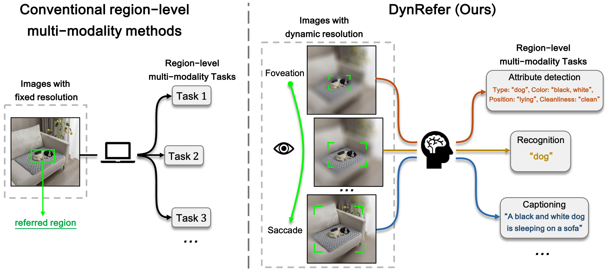

  
# DynRefer: Delving into Region-level Multi-modality Tasks via Dynamic Resolution

This is the official implementaion of paper 'DynRefer: Delving into Region-level Multi-modality Tasks via Dynamic Resolution'. This repository contains Pytorch training code, evaluation code.

## 1. Contents
- DynRefer: Delving into Region-level Multi-modality Tasks via Dynamic Resolution
  - [1. Contents](#1-contents)
  - [2. Get Start](#2-get-start)

## 2. Get Start

- [**Installation**](./docs/install.md)

- [**Data**](./docs/data.md)

- [**Training and Evaluation**](./docs/train_and_eval.md)

